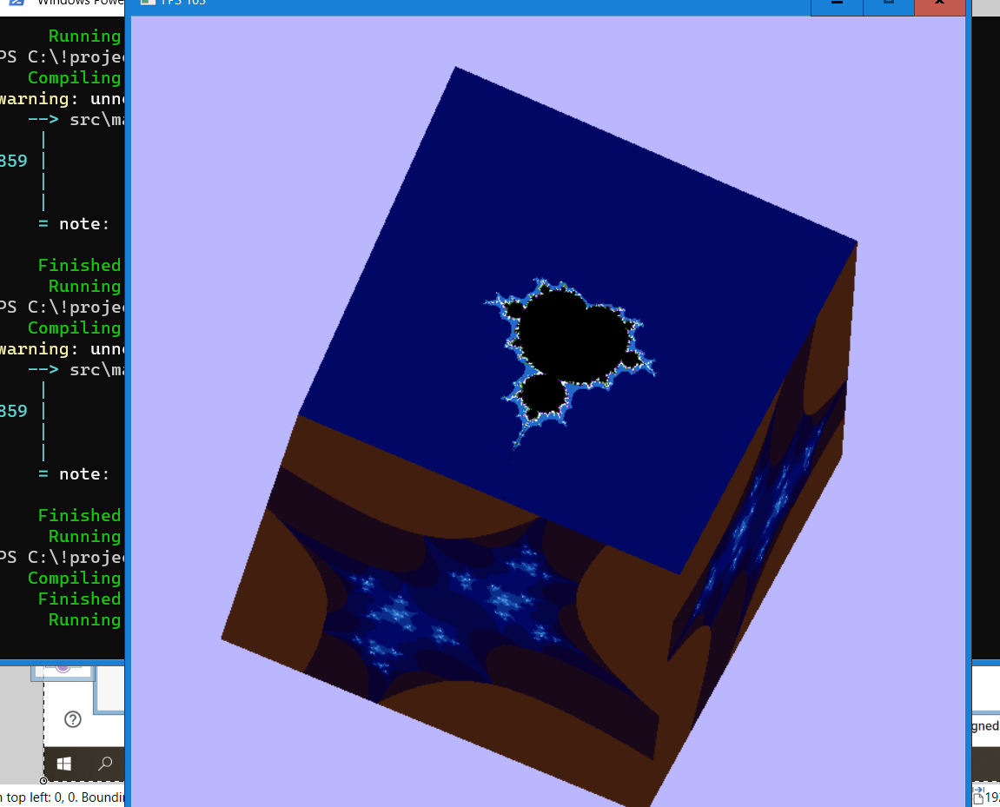

# rust_juliacube
TV cube, software rendering - Julia + Mandelbrot.

Fractal generations runs in a background thread, independent from the main thread rendering, updated when ready and double-buffered.
It is a variation of my old 4k intro from the 90s... 

